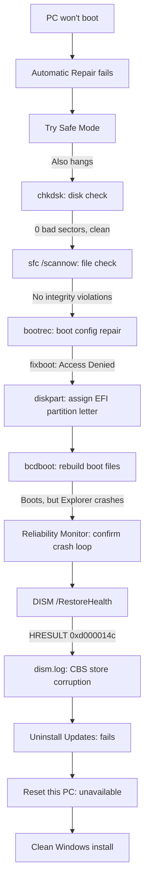

# Windows Boot Failure: A Deep-Dive Recovery Case Study

## Overview
My laptop straight up refused to boot in the middle of active work and job application prep, no less. Great timing. This is the play-by-play of how I diagnosed it, what I tried, what actually mattered, and how it got fixed.

## Initial Symptom
Boot failed with:
- "Your device ran into a problem and couldn't be repaired"
- Log pointed to `SrtTrail.txt` — Automatic Repair had already tried and failed
- Weirdly, the log path used drive letter `E:` instead of `C:` — first hint that something was off with how the recovery environment saw the disk

## Diagnostic Flow

## Diagnostic Timeline

### 1. Startup Repair & Safe Mode
Automatic repair didn't fix it. Safe Mode wouldn't boot either — so this wasn't just a bad driver, something deeper was going on.

### 2. Disk Check

`chkdsk E: /f /r` \
**0 KB in bad sectors**, no file system errors. Disk was completely healthy — good to rule out early, since it meant I wasn't dealing with a dying drive.

### 3. System File Check (offline)

`sfc /scannow /offbootdir=E:\ /offwindir=E:\Windows`\
No integrity violations. System files were intact too.

### 4. Boot Configuration Repair

`bootrec /fixmbr`\
`bootrec /fixboot` --> Access denied\
Turned out the EFI System Partition had no drive letter assigned, which was blocking `fixboot`. Fixed that with `diskpart`, then rebuilt the boot files manually:

`bcdboot E:\Windows /s Z: /f UEFI`\
Boot files rebuilt successfully.

### 5. Explorer Crash Loop
Windows finally loaded after that — except `explorer.exe` kept crashing on repeat. Confirmed it in **Reliability Monitor**, which showed "Shell Infrastructure Host" and "Windows Explorer" failing over and over.

### 6. Digging Deeper with DISM

`DISM /Image:E:\ /Cleanup-Image /RestoreHealth /ScratchDir:E:\ScratchDir`\
Failed with `HRESULT = 0xd000014c`. Checked `dism.log` and found the actual failure was happening in the **CBS (Component-Based Servicing) finalize step** — so the Windows servicing store itself was corrupted, not just a file or two.

### 7. Hit a Wall
- Tried `Uninstall Updates` — failed, system was too unstable to roll back cleanly
- `Reset this PC` wasn't even showing up as an option in recovery, which traced back to the same CBS corruption (`reagentc /info` confirmed WinRE itself was fine, so the option being missing pointed right back to the servicing store)

## Root Cause
Corruption in the Windows Component-Based Servicing (CBS) store, deep enough that SFC, DISM, and even Reset this PC couldn't touch it — even though the disk and personal files were completely fine.

## Resolution
Ended up doing a clean Windows install. Created installation media, booted from USB, and reinstalled — which wiped out the corrupted servicing store and got the system back to a stable, working state.